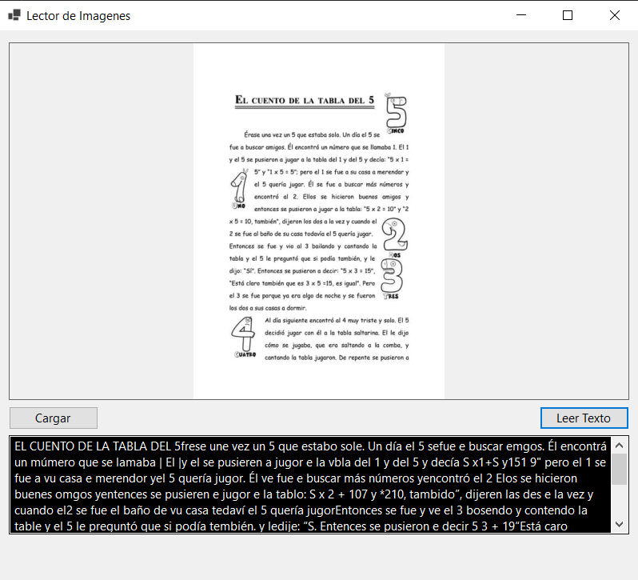

# Lector de Imágenes

Lector de Imágenes es una aplicación de Windows Forms diseñada para cargar imágenes y, potencialmente, leer texto dentro de esas imágenes.

## Características

- **Cargar Imagen**: Puedes cargar fácilmente una imagen usando el botón "Cargar Imagen".
- **Leer Texto**: Una vez cargada la imagen, puedes intentar leer el texto dentro de ella con el botón "Leer Texto".
- **Arrastrar y Soltar**: Puedes cargar una imagen simplemente arrastrándola y soltándola en el área designada.
- **Consola**: La aplicación tiene una consola en la parte inferior donde se muestran mensajes relacionados con las operaciones realizadas.

## Uso

1. Inicia la aplicación.
2. Utiliza el botón "Cargar Imagen" para seleccionar y cargar una imagen o simplemente arrastra y suelta una imagen en el área designada.
3. Si deseas leer el texto dentro de la imagen, simplemente haz clic en "Leer Texto".

## Contribuciones

Las contribuciones son bienvenidas. Siéntete libre de abrir un problema o enviar un pull request.

## Licencia

[MIT](LICENSE)
